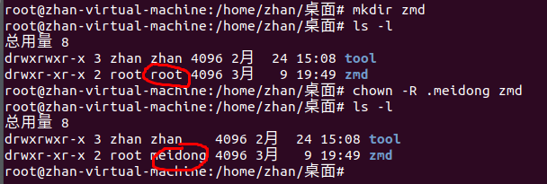

## 用户以及权限管理

### 用户图形管理

**1.** 第一种是图形管理，不赘叙
> 重点注意的是如果更改一个用户的主目录到另一个用户的主目录里面，那两个用户在同一个组

### 用户命令管理

**1.** 密码文件查看
> cat /etc/shadow

**2.** 权限文件更改，必须使用visudo进行编辑，该工具对于语法较为严格

**3** 添加用户
> 使用adduser更好

> 使用adduser添加之后的信息更全面

**4** 用户个人信息相关

**4.1** 查看用户信息
> finger [参数] [用户名]

> 参数加上l最好，信息最详细

**4.2** 更改用户密码
> passwd [参数] [用户名]

> -d表示删除用户密码 -l锁定用户 -u解锁用户
> -m加上天数，表示密码使用最短天数 -x加天数，密码使用最长天数

**4.3** 删除用户
> deluser [参数] [用户名]

> -remove-all-files 删除的时候移除所有信息

### 权限管理

**1.** 三种权限，可读——对于文件而言就是可以直接读，对于文件夹而言就是可以使用ls命令进行查看；可写——就是可以可以修改内容，对于文件夹而言，可写权限就是可以直接修改内容；可执行——对于文件就是可以执行，对于文件夹就是可以进入文件夹

> chmod [参数] [文件名]
* 权限可以用数字表示

> 1-3位数字代表文件所有者的权限，

> 4-6位数字代表同组用户的权限，

> 7-9数字代表其他用户的权限。

> 读取权限：等于4 用 r 表示

> 写入权限：等于2 用 w 表示

> 执行权限：等于1 用 x 表示

> 如果某个用户的权限数字代号是零，则意味着这个用户对于该文件没有任何权限

权限|数字代号
|-|-|
-rw------- (600)   | 只有拥有者有读写权限。
-rw-r--r-- (644)    |只有拥有者有读写权限；而属组用户和其他用户只有读权限。
-rwx------ (700)    |只有拥有者有读、写、执行权限。
-rwxr-xr-x (755)    |拥有者有读、写、执行权限；而属组用户和其他用户只有读、执行权限。
-rwx--x--x (711)    |拥有者有读、写、执行权限；而属组用户和其他用户只有执行权限。
-rw-rw-rw- (666)    |所有用户都有文件读、写权限。
-rwxrwxrwx (777)    |x所有用户都有读、写、执行权限。

**2.** 其他命令
**2.1** chown
* 使用该命令修改文件或目录的归属用户或归属组 
> chown [参数] [用户名] [文件名/目录]

> 发现大部分的R参数都表示递归执行，v显示指令执行的过程

**2.2** chgrp

* 该命令只能修改文件或目录的归属组

> chgrp [参数] [组名] [文件/目录名]
