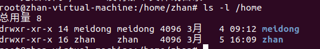

## linux图形界面认识以及虚拟机上的基础设置

### linux图形界面认识
**1.** 个人感觉这个界面和mac的界面以及动画有很多的相似之处，所以操作上没有什么阻隔，毕竟图形化界面都差不了多少

**2.**      可以操作的就是壁纸的外观，这个在图形界面上可以自己寻找到，就不进行追叙，不过比较好玩的是可以通过命令行下载不同的界面版本进行更换
>  apt-get install gnome-session

2.1 还有好玩的就是给gnome桌面设置动画特效
> apt-get install compizconfig-settings-manager
apt-get install emerald

    

    

 
3. 书中还重点提到的东西就是更新器

### 虚拟机上的基础设置
1. 设置网络，直接默认选择nat模式，最省心的模式
2. 把打印机和声卡去掉

## 初始shell以及文档编辑

**1.** linux分为五层，分别是用户层、应用层、shell层、内核层、硬件层，shell把命令传到内核层，然后内核执行，并反馈结果到应用层和用户

**1.1.初级**

> ls -l 加上具体的位置（home可以展示不同账号的文件）

> ls -l /bin/e* 表示以e开头的文件

> ls -l /bin/e？ 表示以e开头的2个字符长度的文件

> ls [a-c] 使用[]值当显示内容，如果[]里面的内容加上一
个！，则表示的意义就是不显示什么内容

>  ; 用于输入多个命令

>  ``命令替代符，在shell表示一条命令，并且执行

>  #注释的符号

**1.2进阶**

1. tab补全，这个世界人民都知道
2. alias 自定义命令 = linux命令 这个可以自己定义命令的代号
3. 重定向操作
> \>直接覆盖前面的内容，
\>> 以追加的方式写入，写在后面
4. 管道操作，使用符号 | 表示，前一个的输出作为后一个命令的输入

**1.3基本命令**

>**ls操作**
> -a显示所有文件，包括隐藏文件
-A 也是显示所有文件，但是不显示当前目录和父目录
-R 递归显示所有文件
以上操作可以组合进行显示

> uname查看系统信息，
 -r 显示版本信息
 -s 列出内核名称
 -o 列出系统信息

 > 使用gedit打开linux的txt编辑应用

 **vim基本操作**

 >vim -r filename 恢复文件（上次文件崩溃需要进行恢复使用这个操作）
 在指令模式下

 操作 | 结果
 |-|-|
 b | 移动到字首
 e |移动到字尾
 nz |将第n行滚动至屏幕顶部
 cc |删除整行
 dd |删除改行
 d加字符 |删除光标所在位置至字符之间的内容
 ndd|删除n行
 nyy|复制n行
 p|粘贴