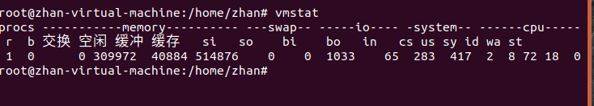
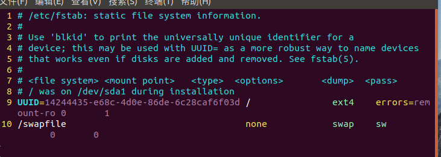
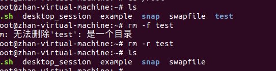
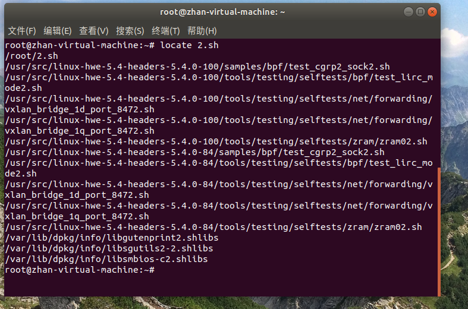

## 文件系统管理

### 文件系统概述概述
1. 文件系统被创建之后，必须要挂载到某个目录，linux使用mount进行挂载
2. /是linux的顶级目录，就是所谓的根目录，从根目录开始就是绝对路径，以下是文件夹的功能介绍
> /bin/ 存储二进制可执行命令文件，/usr/bin/ 也存储一些基于用户的命令文件

> /sbin/ 系统命令的存储文件，/usr/sbin/ 里卖弄也包括很多系统命令

> /root/ 超级用户，根用户的主目录

> /home/ 普通用户的默认目录，每个用户有一个自己的文件夹

> /boot/ 存放ubuntu内核和系统启动文件

> /mnt/ 包括文件系统的挂载点的

> /dev/ 存储设备文件，包括计算机的所有外部设备

> /etc/ 存放系统管理所需要的配置文件和目录

> /lib/ 存储所有的共享库文件，这里是为根目录的命令文件服务， /usr/bin/ 存储普通用户的库文件

> /lost+found/ 该文件一般是空的，系统非法关机会存放一些零散文件

> /var/ 放一些类似日志文件之类的变化快的文件

> /usr/ 存放和系统用户直接有关的文件和目录，类似应用程序和库文件

> /media/ 存放Ubuntu系统自动挂载的设备文件

> /proc/ 虚拟目录，内存的映射，包括系统信息和进程信息

> /tmp/ 存储用户和系统临时文件，该文件夹为任何用户提供读写权

> /initrd/ 载计算机启动时挂载initrd.img映像文件，以及载入所需要
的设备模块的目录

> /opt/ 作为可选文件和程序的存放目录

> /srv/ 存储系统提供的服务数据

> /sys/ 系统设备和文件层次结构 

### 交换分区概述（swap交换分区）
***1.*** 虚拟内存，利用硬盘空间，临时当内存使用，物理内存的扩展，交换分区就是虚拟内存技术的集中体现
***2.*** 交换分区指的是当物理内存不够使用时会释放一部分空间，从而腾出空间，大部分从物理内存使用的数据被存放到交换分区中，还有一部分数据直接交换到文件系统中去，交换分区时“匿名数据”的交换空间

> swapon -s 查看系统的交换分区

***2.1*** 交换分区的大小和物理内存的大小相比应该时大于或等于的关系交换分区的数量对性能也由影响，交换区应该不止一个，这样就可以使用轮流的方式操作于所有的交换分区

**2.2** 交换分区的管理
1. 交换分区是进行分页管理，开始使用的是位映射，现在使用地址访问，寻址空间的上线可扩充至2GB

> vmstat查看系统性能指标

* procs下的w表示：当前（三秒钟之内）需要释放的内存、交换出去的进程数量
* memory下的swpd：表示使用swap空间的大小
* swap下的si表示：当前(三秒钟之内)交换出内存的总量
* swap下的so表示：当前(三秒钟)交换出内存的总量

2. 常用管理方法
* **增加swap空间**

创建swap的文件，路径是自己设置的
> dd if =dev/zero of = /root/swapfile bs = 1024 count = 65536

格式化swap的分区
> mkswap swapfile

激活swap分区的操作
> swapon swapfile

使用vim配置swap文件信息，具体使用图片进行表示
> vim /vim/fstab

删除多余的swap空间
> swapoff swapfile

### 文件解压缩操作
1. zip 和 unzip是一对组合命令，一个解压一个压缩
2. tar是一种使用起来较为广的命令，两者都被包含在这个命令中，以下是tar包含的主要参数

> c:建立新的归档文件

> C<目的目录>:切换到指定的目录

> f<备份文件>：指定归档文件

> j:用tar生成归档文件时，使用bzip2压缩

> k:解开备份文件时不覆盖已有的文件

> m:还原文件时，不变更文件的更改世家

> r:新增文件到已存在的备份文件的结尾部分

> t:累出备份文件的内容

> v:显示指令执行过程

> w:执行过程出现问题询问用户

> x:从备份文件中释放文件

> z:用tar生成归档文件，使用gzip压缩

> Z:用tar生成归档文件，使用compress压缩

### 文件的基本操作

1. touch创建新文件
2. cp复制文件
> 语法：cp [参数] [源地址] [目的地]

3. mv移动文件
> mv [参数] [源地址] [目的地址]
4. rm删除文件

> rm [参数] [目的地址]

> rm -rf [r,递归处理，删除所有文件以及子目录] [f,强制删除所有文件]

5. mkdir和rmdir进行文件夹创建和文件夹删除的操作

> rmdir进行删除之后加一个操作数 -p 就是如果上层目录是空目录，则就将其一起删除

6. more 显示命令，后面加上一个 -n,这个n代表的是自己想要看几行文件内容，再在后面加上一个文件地址即可，使用q退出查看
> more -8 /etc/passwd

* less也是一个显示命令，与more命令基本相同，和more不同的位置是底部显示不一样
* head用于显示一个文件的前面几行或者前面几个字节（个人感觉这个命令不是很适用）
* tail的使用范围和head相同，区别于显示一个文件的最后几行或几个字节

    > tail [参数] [文件名]

    > -num,显示最后num个字节

7. 关于文件属性的查看，使用file可以进行文件类型的查看
> file [参数] [文件名]

> b 列出标识结果，不显示文件名称

> v 显示版本信息

8. 文件查询
* 使用find进行查询

> find [路径] [参数] [关键字]

>>这个里面的参数指的是使用什么方式进行查询. 

> amin或者atime后面加上存取的时间

>cmin或者ctime后面加上更改的文件

> name是找和文件名匹配的文件

>size是大小，typ<文件类型> user<用户>

* locate也可以进行文件的,直接去保存文件与目录名称的数据库内进行查找，所以它的速度比find要快一点 locate [参数]  [关键字]

> -d<数据库文件> 更改查询的数据库 -w匹配整个路径 -c只显示找到的条目数量

* grep查找内容包含指定的关键字的文件，如果发现了符合的文件，grep指令会把含有范本样式的那一列显示出来
**grep [参数] 关键字 文件列表**

> -c 计算符合范本样式的列数 -d<进行动作> ，查找目录时使用

> -i 忽略字符大小写的差别 -v 反转查找，只显示不匹配的行

> -x 只显示整行严格匹配的行  -r 在指定目录中递归查找

9. 其他重要命令
* ln命令用于创建链接文件，ln [参数] [目的地址] [链接文件名]

> -b 删除，覆盖目标文件之前的备份  -d 建立目录的硬链接

> -i 覆盖既有文件之前询问用户  -s 建立符号链接(缺省情况建立硬链接)

* wc统计文件的字数，字节数，行数

> -c 显示字节数 -l显示行数 -w 显示字数