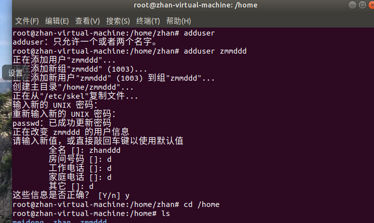

## 用户以及权限管理

### 用户图形管理

**1.** 第一种是图形管理，不赘叙
> 重点注意的是如果更改一个用户的主目录到另一个用户的主目录里面，那两个用户在同一个组

### 用户命令管理

**1.** 密码文件查看
> cat /etc/shadow

**2.** 权限文件更改，必须使用visudo进行编辑，该工具对于语法较为严格

**3** 添加用户
> 使用adduser更好

> 使用adduser添加之后的信息更全面

**4** 用户个人信息相关

**4.1** 查看用户信息
> finger [参数] [用户名]

> 参数加上l最好，信息最详细

**4.2** 更改用户密码
> passwd [参数] [用户名]

> -d表示删除用户密码 -l锁定用户 -u解锁用户
> -m加上天数，表示使用最短天数 -x加天数，最长天数

**4.3** 删除用户
> deluser [参数] [用户名]

> -remove-all-files 删除的时候移除所有信息
